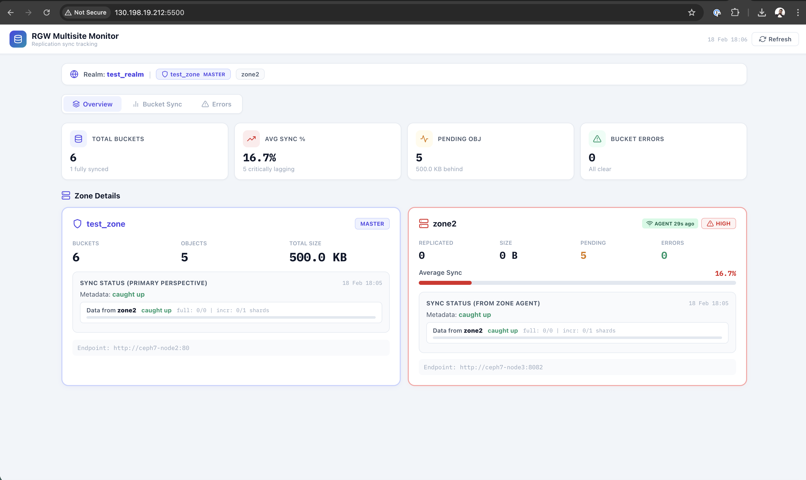

# Ceph RGW Multisite Sync Monitor

A monitoring solution for Ceph RGW multisite replication — providing **granular bucket-level sync tracking**, **per-bucket error analysis**, **shard-level sync visibility from secondary zones**, and a **consolidated dashboard**.

> **[Executive Summary](executive_summary.md)** · **[Dashboard Screenshots](screenshots/)** · **[pip Install Package](binary/)**

| Overview Tab | Bucket Sync Tab |
|---|---|
|  |  |

## Problem

In Ceph RGW multisite deployments, monitoring replication health is painful:

- `sync status` and `sync error list` run on the **primary** zone show almost nothing — the real sync state lives on the **secondary** where the pull-based replication runs
- No consolidated view across zones — engineers manually SSH between nodes running different commands
- No per-bucket granularity — you can see global sync shards but not which buckets are lagging
- Bucket-level sync policies mean some buckets replicate while others are halted

## Solution

Two-component architecture:

1. **Primary site dashboard** — runs on the master zone, auto-discovers topology, collects bucket stats, serves the web dashboard
2. **Secondary zone agent** — lightweight script on each secondary zone that collects sync status, sync errors, and per-bucket shard sync, then pushes processed data to the primary

## Architecture

```
┌─ Secondary Zone Node ──────────────────────────────────┐
│                                                         │
│  zone_agent.py (lightweight, no deps)                   │
│  ├─ radosgw-admin sync status        (parsed)           │
│  ├─ radosgw-admin sync error list    (parsed)           │
│  └─ radosgw-admin bucket sync status (per-bucket)       │
│                                                         │
│  Pushes processed JSON every 60s ──────────────────┐    │
└─────────────────────────────────────────────────────│────┘
                                                      │
                                              POST /api/zone-agent/push
                                                      │
┌─ Primary Zone Node ─────────────────────────────────│────┐
│                                                      │    │
│  ┌── Dashboard (React) ──────────────────────────┐  │    │
│  │ Overview     │ Bucket Sync    │ Errors         │  │    │
│  │ (per-zone    │ (per-bucket    │ (primary +     │  │    │
│  │  summary +   │  obj delta +   │  agent errors  │  │    │
│  │  agent sync) │  shard sync)   │  merged)       │  │    │
│  └──────────────┴────────────────┴────────────────┘  │    │
│                                                      │    │
│  ┌── API Server (Flask) ─────────────────────────┐   │    │
│  │ /api/dashboard   /api/zone-agent/push  ◄──────┘   │    │
│  │ /api/zone-agents /api/buckets  /metrics           │    │
│  └───────────────────────┬───────────────────────┘   │    │
│                          │                            │    │
│  ┌── Collector Engine ───┴───────────────────────┐   │    │
│  │ radosgw-admin bucket stats       (per zone)   │   │    │
│  │ radosgw-admin bucket stats --rgw-zone X       │   │    │
│  │ radosgw-admin sync status        (primary)    │   │    │
│  │ radosgw-admin sync error list    (primary)    │   │    │
│  │ Optional: REST API for secondary bucket stats │   │    │
│  └───────────────────────────────────────────────┘   │    │
└──────────────────────────────────────────────────────────┘
```

### Why two components?

`radosgw-admin sync status` run on the **primary** only tells you "I'm the master." The meaningful sync state — how far behind, which shards are lagging, what errors are happening — lives on the **secondary** zone because that's where the pull-based sync process runs. Same for `sync error list` — errors are recorded on the zone doing the pulling.

The zone agent solves this by running locally on the secondary and pushing **processed** (not raw) data to the primary dashboard. No SSH tunnels needed.

## Prerequisites

**Primary site (dashboard node):**
1. `radosgw-admin` installed and on PATH
2. Ceph cluster access (`ceph status` works)
3. Multisite configured (realm + period exist)
4. Python 3.6+ with Flask (`pip install flask`)
5. Network reachable from secondary zone(s)

**Secondary zone(s) (agent node):**
1. `radosgw-admin` installed and on PATH
2. Ceph cluster access from this node
3. Python 3.6+ (no extra packages needed — uses only stdlib)
4. Network access to primary dashboard API (HTTP, port 5000 by default)

## Quick Start

### Option A: pip install (recommended)

Install the pre-built package from [`binary/`](binary/) — see the [binary README](binary/README.md) for full CLI reference.

```bash
pip install binary/rgw_multisite_monitor-0.1.0-py3-none-any.whl

rgw-monitor init       # validate cluster access, generate config
rgw-monitor start      # launch dashboard on :5000
```

### Option B: Run from source

#### Step 1: Start the primary dashboard

On the **master zone** admin/mon node:

```bash
git clone <repo-url> && cd rgw-multisite-monitor
chmod +x setup.sh
./setup.sh
```

Verify it's running:
```bash
curl http://localhost:5000/api/health
# {"status":"ok","collector_running":true,"ceph_access":true}
```

Open the dashboard at `http://<primary-node>:5000`

#### Step 2: Deploy the zone agent on secondary

Copy **only** `backend/zone_agent.py` to the secondary zone node. No other files needed.

```bash
# On the secondary zone node:
scp primary-node:/path/to/rgw-multisite-monitor/backend/zone_agent.py .

# Test connectivity + collection (dry-run prints payload without pushing):
python3 zone_agent.py --primary-url http://primary-node:5000 --once --verbose

# Start the agent:
python3 zone_agent.py --primary-url http://primary-node:5000
```

That's it. The dashboard will show a green **AGENT** badge on the secondary zone card within 60 seconds.

> **pip alternative for the agent:** `rgw-monitor agent -u http://primary-node:5000`

#### Step 3: Verify

On the primary node, check the agent is pushing data:
```bash
curl http://localhost:5000/api/zone-agents
# {"us-west-2":{"last_push":"2025-...","age_seconds":23,"stale":false,...}}
```

The dashboard will now show:
- **Overview tab**: Secondary zone card includes "Sync Status (from zone agent)" with metadata sync, data sync shard progress, and a sync bar
- **Bucket Sync tab**: Each bucket card shows per-zone shard sync status alongside the object-count sync bar
- **Errors tab**: Errors from both the primary and zone agent are merged, with source labels

## Zone Agent Reference

### CLI Usage

```bash
python3 zone_agent.py [OPTIONS]

Options:
  --primary-url, -u   URL of the primary dashboard API (required)
  --interval, -i      Push interval in seconds (default: 60)
  --zone, -z          Zone name (default: auto-detect from sync status)
  --max-buckets       Max buckets to collect sync status for (default: 500)
  --config, -c        Path to agent config YAML file
  --once              Run one cycle and exit (for cron or testing)
  --dry-run           Collect and print payload without pushing
  --verbose, -v       INFO-level logging
  --debug, -d         DEBUG-level logging (shows CLI commands)
```

### Config File (optional)

```yaml
# agent.yaml
primary_url: http://primary-node:5000
push_interval: 60
zone_name: ""           # empty = auto-detect
max_buckets: 500
```

```bash
python3 zone_agent.py --config agent.yaml
```

### Running as systemd Service

```ini
# /etc/systemd/system/rgw-zone-agent.service
[Unit]
Description=RGW Multisite Zone Agent
After=ceph-radosgw.target network-online.target
Wants=network-online.target

[Service]
Type=simple
User=ceph
ExecStart=/usr/bin/python3 /opt/rgw-monitor/zone_agent.py \
  --primary-url http://primary-node:5000 \
  --interval 60 \
  --verbose
Restart=always
RestartSec=10

[Install]
WantedBy=multi-user.target
```

```bash
sudo systemctl enable --now rgw-zone-agent
sudo journalctl -u rgw-zone-agent -f
```

### What the Agent Collects

| Command | What it captures | Why it matters |
|---|---|---|
| `radosgw-admin sync status` | Global sync state from this zone's perspective — metadata sync, per-source data sync shard counts | Shows actual sync progress (not available from primary) |
| `radosgw-admin sync error list` | Errors encountered while pulling data from other zones | Errors are recorded where sync runs, not on the source |
| `radosgw-admin bucket sync status --bucket X` | Per-bucket shard-level sync detail with source zone breakdown | Shows which buckets and which shards are behind |

All output is **parsed** into structured JSON before being pushed. The primary never sees raw CLI output from the secondary.

### Pre-flight Checks

The agent validates before starting:
1. `radosgw-admin` binary exists on PATH
2. Cluster access works (tries `realm get` and `sync status`)
3. Primary API is reachable (GET `/api/health`)
4. Zone name is auto-detected or provided

### Payload Structure

```json
{
  "zone_name": "us-west-2",
  "timestamp": "2025-02-17T10:30:00Z",
  "agent_version": "1.0",
  "sync_status": {
    "status": "ok",
    "realm": "production",
    "zone": "us-west-2",
    "metadata_sync": {"status": "caught up", "full_sync_done": 0, ...},
    "data_sync": [
      {"source_zone": "us-east-1", "status": "syncing",
       "full_sync_done": 0, "full_sync_total": 128,
       "incremental_sync_done": 120, "incremental_sync_total": 128}
    ]
  },
  "sync_errors": [...],
  "bucket_sync_status": {
    "my-bucket": {
      "bucket": "my-bucket",
      "sources": [
        {"source_zone": "us-east-1", "status": "caught up",
         "full_sync_done": 16, "full_sync_total": 16,
         "incremental_sync_done": 16, "incremental_sync_total": 16,
         "shard_count": 16, "problem_shards": []}
      ]
    }
  }
}
```

## Configuration (Primary)

**No configuration is required for basic operation.** The `config.yaml` file is entirely optional.

### Optional: REST API for Secondary Bucket Stats

If `radosgw-admin bucket stats --rgw-zone <secondary>` doesn't return stats for remote zones, enable REST API mode:

```yaml
# config.yaml
use_rest_for_bucket_stats: true
access_key: "YOUR_ACCESS_KEY"
secret_key: "YOUR_SECRET_KEY"
```

Create the monitor user:
```bash
radosgw-admin user create \
  --uid=rgw-monitor \
  --display-name="RGW Multisite Monitor" \
  --caps="buckets=read;metadata=read;usage=read;zone=read"
```

### Full Configuration Reference

| Field | Required | Default | Description |
|---|---|---|---|
| `collection_interval` | No | `60` | Seconds between collection cycles |
| `use_rest_for_bucket_stats` | No | `false` | Query zone endpoints via REST for bucket stats |
| `access_key` | Only if REST | — | RGW admin user access key |
| `secret_key` | Only if REST | — | RGW admin user secret key |
| `verify_ssl` | No | `false` | Verify TLS for REST API calls |

## API Reference

| Endpoint | Method | Description |
|---|---|---|
| `/api/health` | GET | Health check + Ceph access status |
| `/api/topology` | GET | Discovered multisite topology |
| `/api/dashboard` | GET | Full dashboard data (includes zone_agents) |
| `/api/dashboard?last_n=6` | GET | Dashboard with last N snapshots |
| `/api/buckets` | GET | Bucket list sorted by sync progress |
| `/api/buckets/<name>` | GET | Bucket detail with history + errors |
| `/api/errors` | GET | Global sync error list |
| `/api/sync-status` | GET | Global sync status history |
| `/api/zone-agent/push` | POST | Receive data from zone agent |
| `/api/zone-agents` | GET | Status of all connected zone agents |
| `/api/config` | POST | Update config and restart collector |
| `/api/config` | GET | Current config (secrets masked) |
| `/api/collect` | POST | Trigger manual collection cycle |
| `/api/events` | GET | SSE stream for real-time updates |
| `/metrics` | GET | Prometheus metrics |

## Dashboard Features

### Overview Tab
- **Summary cards**: total buckets, avg sync %, pending objects, error count
- **Master zone card**: bucket count, total objects, total size
- **Secondary zone cards**: replicated count, pending, errors, avg sync bar, **agent sync status** with metadata/data sync shard progress
- **Global sync check**: last sync status from primary perspective

### Bucket Sync Tab
- Per-bucket cards with primary stats, per-zone sync bars (object count delta), **per-zone shard sync** from agent
- Search, filter by priority, sort by name/sync%/delta/errors
- Click any bucket for detail modal with zone comparison, sync history, shard detail, errors

### Errors Tab
- Merged errors from primary + all zone agents with source labels
- Grouped by error code and by bucket
- Error source breakdown showing count per zone

### Priority Classification

| Priority | Sync % | Meaning |
|---|---|---|
| HIGH | < 85% | Critical lag — immediate attention |
| MEDIUM | 85–94% | Notable lag — monitor closely |
| LOW | 95–98% | Minor lag — catching up |
| SYNCED | >= 99% | Fully synced |

## Troubleshooting

### Agent not connecting

```bash
# Test from secondary node:
curl http://primary-node:5000/api/health

# If unreachable, check firewall:
sudo firewall-cmd --add-port=5000/tcp --permanent
sudo firewall-cmd --reload
```

### Agent shows STALE badge

The agent badge turns yellow "STALE" if no push has been received for 5+ minutes. Check:
```bash
# On secondary:
sudo journalctl -u rgw-zone-agent --since "5 minutes ago"

# Test a single push:
python3 zone_agent.py --primary-url http://primary-node:5000 --once --debug
```

### SignatureMismatch for REST bucket stats

```bash
# Verify user keys:
radosgw-admin user info --uid=rgw-monitor

# Run the test script:
cd backend/
python3 test_steps.py --step 5 --verbose
```

### No sync data from primary perspective

This is expected. The primary zone's `sync status` output is mostly empty because it's the master — it doesn't pull data from anywhere. The real sync state comes from the zone agent on the secondary.

## File Structure

```
cephMultisiteObservability/
├── README.md                          # This file
├── executive_summary.md               # One-page overview for leadership
├── multisiteSetup.md                  # Lab setup guide
├── config.yaml                        # Optional primary configuration
├── setup.sh                           # Quick-start (validates, installs, starts)
├── generateLoad.sh                    # Test load generator
├── adminRGWAPI/
│   └── api.py                         # Standalone RGW admin REST API helper
├── backend/
│   ├── collector.py                   # Primary: CLI-based data collector + data store
│   ├── api_server.py                  # Primary: Flask REST API + zone agent receiver
│   ├── zone_agent.py                  # Secondary: standalone agent (no deps beyond stdlib)
│   ├── test_steps.py                  # Validation test script
│   └── requirements.txt
├── binary/                            # pip-installable package
│   ├── README.md                      # Install & CLI reference (rgw-monitor command)
│   ├── cli.py                         # CLI entry point source
│   ├── pyproject.toml                 # Python package config
│   └── rgw_multisite_monitor-*.whl    # Pre-built wheel
├── dashboard/
│   ├── RGWMultisiteMonitor.jsx        # React dashboard source
│   ├── build_html.py                  # JSX → self-contained HTML builder
│   └── index.html                     # Built dashboard (generated)
└── screenshots/                       # Dashboard screenshots
    ├── README.md                      # Screenshot gallery
    └── *.png
```